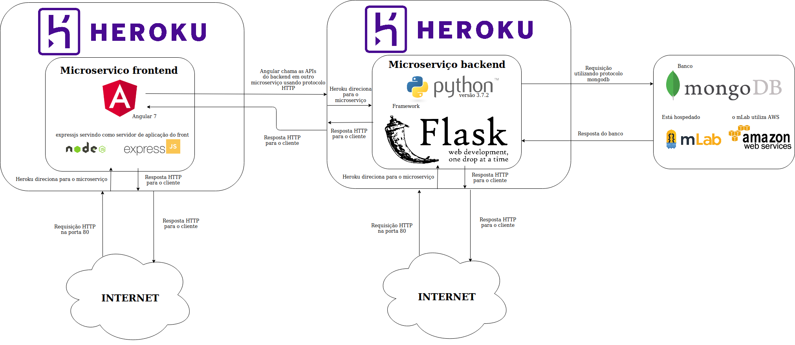
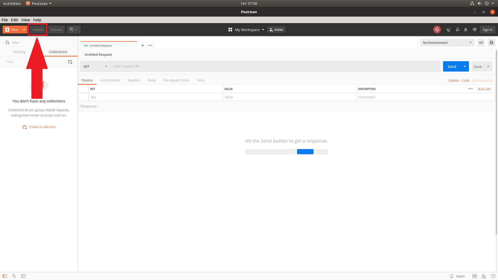
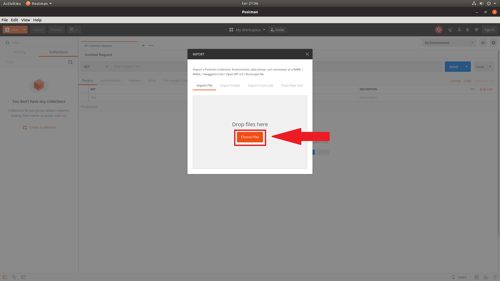
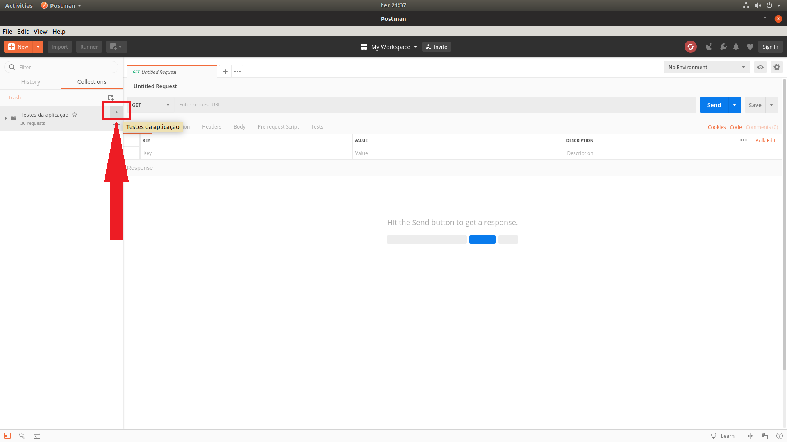
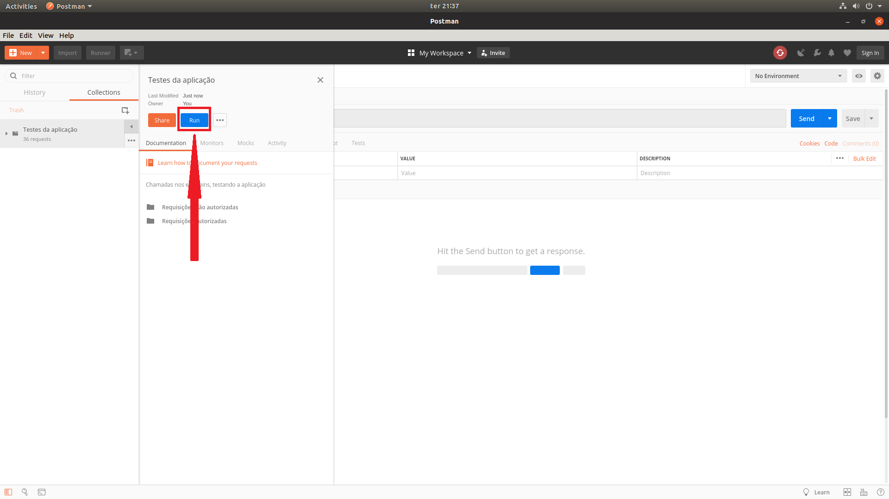
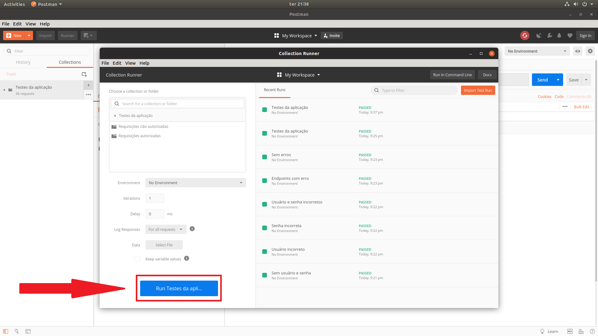

# Simulação de campeonato

Aplicação que simula um campeonato, utilizando um microserviço para o backend feito em `python 3.7.2`
utilizando o framework `flask` e um microserviço para o frontend feito em `Angular 7` e `expressjs`.

### Desenho da arquitetura

Para poder servir o front, foi necessário subir no heroku uma aplicação em `nodeJS`, utilizando o framework `expressjs`,
a única função deste framework é responder os conteúdos estáticos do front já buildados para o ambiente produtivo, ou seja,
ele só responde para o browser o arquivo `HTML` e os arquivos `JS`.

O frontend chama as APIs expostas do backend utilizando o protocolo HTTP, para pode mostrar os resultados das partidas e buscar
por outros times no back, para poder ver como o time se desempenhou na fase de grupo e se ele foi classificado nos playoffs, por exemplo.

O frontend se encontra no link https://ri-me-front.herokuapp.com/

O backend possui vários endpoints disponíveis que respondem tanto um cliente qualquer um que queira consumir seus dados, ou o próprio frontend
que consome as APIs do back, como foi citado anteriormente.

Ele sempre responde JSON ou uma mensagem de erro.

Para microserviço do backend comunicar-se com o banco, foi utilizada a biblioteca `pymongo`.

### Endpoits disponíveis backend

Todas as rotas precisam de autenticação (`username` = `user` e `password` = `user-pass`),
a autenticação está **hard-coded**, ou seja, é necessário passar exatamente este usuário e está senha.
Caso contrário não será possível utilizar a API.

Por exemplo:

`$ curl --user user:user-pass https://ri-me.herokuapp.com/simular`

- [GET] https://ri-me.herokuapp.com/simular
    - Simula um novo campeonato, removendo os dados existentes no banco e inserindo os dados da nova simulação

- [DELETE] https://ri-me.herokuapp.com/simular
    - Deleta o último campeonato do banco

- [GET] https://ri-me.herokuapp.com/time/fase-de-grupos/<numero-que-representa-o-time>
    - Retorna os jogos de um determinado time na fase de grupos (array de JSON)
    - O time precisa estar entre os valores de 1 a 80
    - Retorna uma mensagem de erro caso seja passado um número fora do intervalo ou não seja passado um número

- [GET] https://ri-me.herokuapp.com/time/partidas-playoffs/<numero-que-representa-o-time> 
    - Retorna os jogos de um determinado time nos playoffs (Array de JSON)
    - O time precisa estar entre os valores de 1 a 80
    - Retorna uma mensagem de erro caso seja passado um número fora do intervalo ou não seja passado um número
    - Retorna uma mensagem de erro caso o time não tenha sido qualificado para os playoffs

- [GET] https://ri-me.herokuapp.com/pontuacao-final-grupos
    - Retorna a situação final de todos os times após a fase de grupos

- [GET] https://ri-me.herokuapp.com/final
    - Retorna o resultado da final (um único JSON)

### Possíveis respostas do servidor

Sempre verificar as mensagens de resposta do servidor!!

- `200: OK`
    - Retorna os dados requisitados no banco
    - **OU**
    - Os dados do campeonato foram removidos do banco
- `201: Created` Um novo campeonato foi simulado e inserido no banco
- `401: Unauthorized` Não foi passado usuário e senha, permissão negada
- `404: Not Found`
    - Time requisitado não encontrado ou banco de dados vazio
    - **OU**
    - Endpoint inexistente

### Testes

Os testes deste micro-serviço foram feitos utilizando o software [postman](https://www.getpostman.com/).

Eles se encontram na pasta [testes](https://bitbucket.org/ricardobr001/ri_me/src/master/testes/), para importá-los
no postman basta abrir o programa e seguir o tutorial abaixo.

